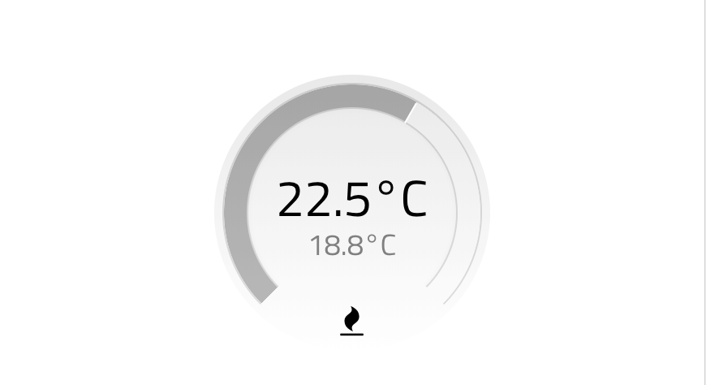
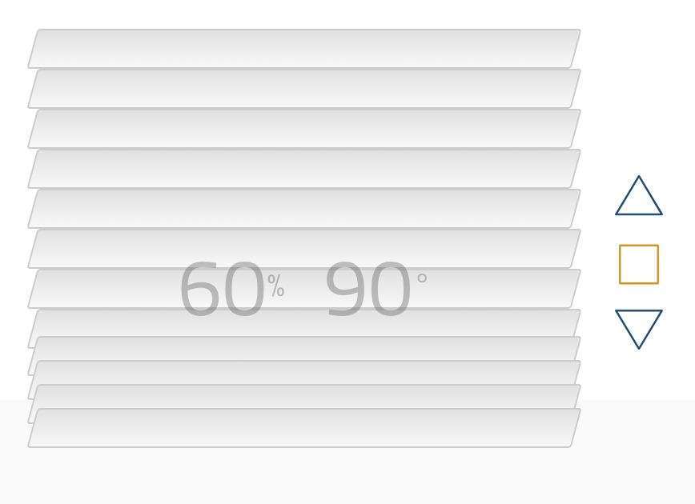
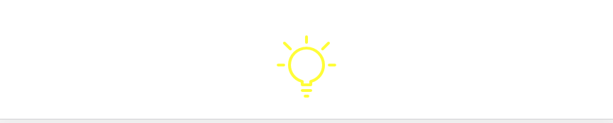
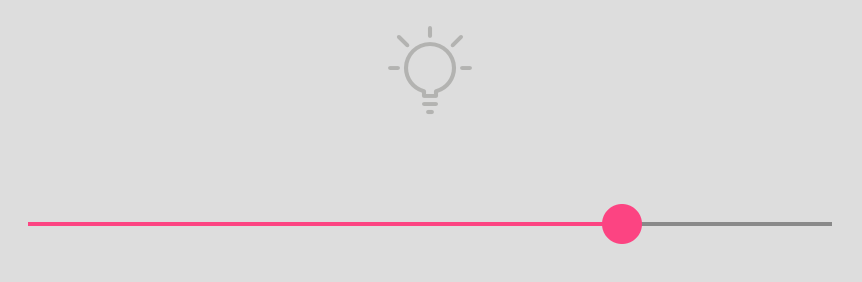
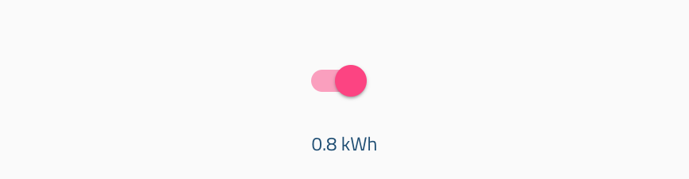
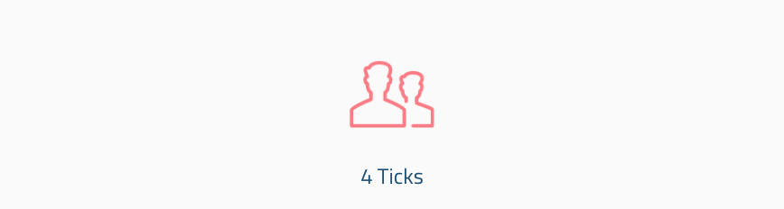
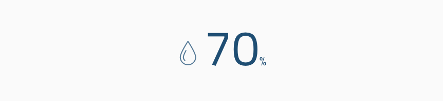
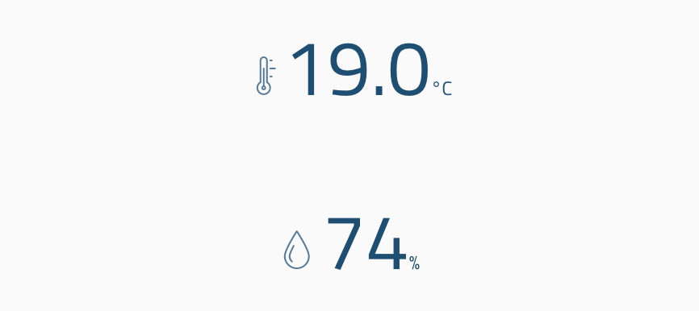

# thing-it-device-ui
UI Components for [thing-it] Device, Actor and Sensor UIs

Supports complex UIs such as

* Thermostats
* Jalousies
* Light
* Dimmer 
* Switch
* Motion Sensor
* Temperature Sensor
* Humidity Sensor

# Setup

```
npm install
```

# Testing

Run server via 

```
npm server
```

UI can be found under

```
http://localhost:3333/test/index.html
```

# Components

# General

## Options

All components can be configured in behavior and appearance via options, e.g.

```
<ti-thermostat options="{maximumSetpointChange: 4, units: 'F'}" ...
```


# Thermostat

```
<ti-thermostat state="component._state"
                   change="portal.callActorService(component, 'setState', component._state)"></ti-thermostat>
```

*state* must contain the fields *setpoint* and *temperature*.

Changes to the state object are only detected if the reference is changes, i.e.

```
this._state = {setpoint: this._state.setpoint, temperature: 27};
```

as opposed to

```
this._state.temperature = 27;
```

## State Fields

* **setpoint**
* **temperature**

## Functions

* **change**

## Options

* **maximumSetpointChange** maximal value the setpoint can changed by in one gesture
* **units**, string with e.g. F or °C

## UI

<p align="center"><a href="./doc/images/thermostat.png"></a></p>

# Jalousie

```
<ti-jalousie state="component._state" change="portal.callActorService(component, 'setState', component._state)"
                   up="portal.callActorService(component, 'up', component._state)"
                   down="portal.callActorService(component, 'down', component._state)"></ti-jalousie>
```

*state* must contain the fields *percentage* and *rotation*.

Changes to the state object are only detected if the reference is changes, i.e.

```
this._state = {position: this._state.position, rotation: 90};
```

as opposed to

```
this._state.rotation = 90;
```

## State Fields

* **position**, integer between 0 and 100
* **rotation** integer between 0 and 90 indicating degree of rotation, 0 being closed

## Functions

* **change**
* **up**
* **down**

## UI

<p align="center"><a href="./doc/images/jalousie.png"></a></p>

# Light

```
<ti-light state="component._state"
                   change="portal.callActorService(component, 'setState', component._state)"></ti-thermostat>
```

## State Fields

* **switch**, boolean for switch state
* **power** current power consumption

## Functions

* **change**

## UI

Users can click everywhere in the component to toggle the light state.

<p align="center"><a href="./doc/images/light.png"></a></p>

# Dimmer

```
<ti-dimmer state="component._state"
                   change="portal.callActorService(component, 'setState', component._state)"></ti-dimmer>
```

## State Fields

* **switch**, boolean for switch state
* **brightness**, boolean for switch state
* **power** current power consumption

## Functions

* **change**

## UI

Users can click everywhere in the component to toggle the light state. Light will be switched on in the brightness adjusted via the slider.

<p align="center"><a href="./doc/images/dimmer.png"></a></p>

# Switch

To represent an on/off plug or switch which can also optionally measure/display power consumption.

```
<ti-switch state="component._state"
                   change="portal.callActorService(component, 'setState', component._state)"></ti-switch>
```

## State Fields

* **switch**, boolean for switch state
* **power** current power consumption

## Functions

* **change**

## UI

<p align="center"><a href="./doc/images/switch.png"></a></p>

# Temperature Sensor

```
<ti-temperature-sensor state="component._state"
                   change="portal.callActorService(component, 'setState', component._state)"></ti-temperature-sensor>
```

## State Fields

* **temperature**, temperature value

## Functions

* **change**

## UI

<p align="center"><a href="./doc/images/temperature-sensor.png"></a></p>

# Motion Sensor

```
<ti-motion-sensor state="component._state"
                   change="portal.callActorService(component, 'setState', component._state)"></ti-motion-sensor>
```

## State Fields

* **motion**, boolean indicating whether any motion is detected
* **ticks** measured tick counts correlated with movements

## Functions

* **change**

## UI

<p align="center"><a href="./doc/images/motion-sensor.png"></a></p>

# Humidity Sensor

## State Fields

* **humidity**, integer in percent

## Functions

* **change**

## UI

<p align="center"><a href="./doc/images/humidity-sensor.png"></a></p>

# Combining UI Components

You can easily combine plugins like

```
<ti-temperature-sensor state="component._state"></ti-temperature-sensor>
<ti-humidity-sensor state="component._state"></ti-humidity-sensor>
```

assuming that the **component** provides the state fields **temperature** and **humidity**,
resulting in a UI like

<p align="center"><a href="./doc/images/multi-sensor.png"></a></p>
